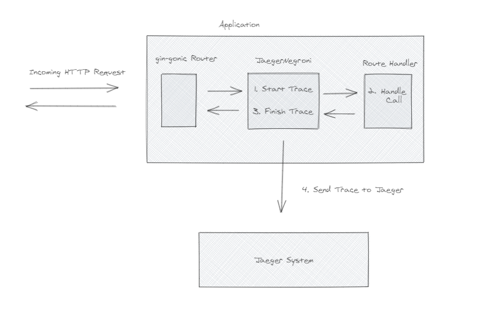

## `Jaeger Negroni` - Distributed Tracing Middleware for `Gin-Gonic` Applications

`Jaeger` is a distributed tracing framework that implements the `opentracing` standard
to trace API calls in micro-service architectures. The opentracing standard traces
applications by executing calls in the context of `span` objects, which can be 
tagged with `key:value` pairs to offer comprehensive, real-time API tracing. The Jaeger
implementation of the `opentracing` standard works by sending locally generated spans
to a `jaeger-agent` in the form of UDP packets, which provides a low overhead and low risk
method of tracing API's.

The `jaeger-negroni` application is nothing but a middleware for the popular `gin-gonic`
framework; the middleware generates a global `jaeger tracer` when the application starts,
and all calls are executed in the context of a `opentracing` span. The spans are then sent
to a `jaeger-agent` (ideally locally), which can be easily implemented via Docker. All calls
to the `gin-gonic` application are then traced, and all traces can be viewed on the Jaeger
UI. Graphically, this can be illustrated as follows

<br>

<br>
<br>

Note that, in order for the `JaegerNegroni` middleware to work, users need a running Jaeger 
instance. See https://www.jaegertracing.io/docs/1.18/ for details on Jaeger and its Architecture
and how to set it up. For local testing, Jaeger provides an all-in-one docker image that
can be run which contains all the components (and UI) needed for Jaeger, and can be run with

```console
$ docker run -p 6831:6831/udp -p 6832:6832/udp -p 16686:16686 --name local-jaeger --env LOG_LEVEL=debug jaegertracing/all-in-one:latest
```

The UI will then be accessible at `localhost:16686` and Jaeger Spans can be sent to `localhost:6831`

#### Implementing `JaegerNegroni` Middleware

In order to use the `JaegerNegroni` middleware, the following steps need to be implemented

1. Create a global tracer using the `GetJaegerTracer()` function
2. Add the middleware to the `gin-gonic` router using the `Use()` function

##### Create Global Tracer 

The Global Tracer and be instantiated using the `GetJaegerTracer()` function

```go
// create configuration for jaeger tracer
config := jaeger_negroni.JaegerConfig{ Host: "localhost", ServiceName: "testing-service", Port: 6831 }

// create instance of global tracer and defer closing 
closer := jaeger_negroni.GetJaegerTracer(config)
defer closer.Close()
```

Note that the `GetJaegerTracer()` takes a `JaegerConfig` struct as an argument, which defines the 
host, port and service name used by the tracer. The `GetJaegerTracer()` also return an instance of
the `io.Close` interface, which should be handled with a `defer` call as done above.

##### Add `JaegerNegroni` Middleware

Once the Tracer has been created, the Middleware can be added. One important thing to note about the Middleware is that it is created with an Array of `JaegerMetric` objects for Pre and Post request. The `JaegerMetric` interface allows users to define a set of tags (`key:value` pairs) that are tagged unto each trace. The `JaegerNegroni` interface provides the `DefaultPreRequestJaegerMetrics()` and `DefaultPostRequestJaegerMetrics()`  functions, which create an array of default Jaeger Tags for both pre and post requests if users do not want to set their own interface(s). The default interfaces include

1. `URLJaegerMetric` - tags each span with the url called
2. `RequestTimeJaegerMetric` - tags each span with the current UTC time at the time of call
3. `ProcessedTimeJaegerMetric` - tags each span with the current UTC time evaluated post-request
4. `RequestStatusJaegerMetric` - tags each span with the HTTP status code evaluated post-request

See below for more details on the `JaegerMetric` interface and how to setup your own tags

In order to implement the Middleware, simply call

```go
// get default metrics used to tag spans
pre_metrics, post_metrics := jaeger_negroni.DefaultPreRequestMetrics(), jaeger_negroni.DefaultPostRequestMetrics()

// apply JaegerNegroni MiddleWare for Jaeger Tracing functionality
router.Use(jaeger_negroni.JaegerNegroni(pre_metrics, post_metrics))
```

where the `router` instance is the `gin-gonic` router used to serve the application. Thats it! All the incoming requests will now be traced, and all the traces will the available to view and aggregate on your Jaeger UI. All together, a basic instrumentation is achieved with

```go

package main

import (
	"github.com/gin-gonic/gin"
	log "github.com/sirupsen/logrus"
	jaeger_negroni "github.com/PSauerborn/Jaeger-Negroni/jaeger_negroni"
)


func main() {
	log.SetLevel(log.DebugLevel)

	// create new instance of router
	router := gin.New()
	router.Use(gin.Recovery())

	// create configuration for jaeger tracer
	config := jaeger_negroni.JaegerConfig{ Host: "localhost", ServiceName: "testing-service", Port: 6831 }

	// create instance of global tracer and defer closing 
	closer := jaeger_negroni.GetJaegerTracer(config)
	defer closer.Close()

	// get default metrics used to tag spans
	pre_metrics, post_metrics := jaeger_negroni.DefaultPreRequestMetrics(), jaeger_negroni.DefaultPostRequestMetrics()

	// apply JaegerNegroni MiddleWare for Jaeger Tracing functionality
	router.Use(jaeger_negroni.JaegerNegroni(pre_metrics, post_metrics))
	router.GET("/health_check", func(context *gin.Context) { context.JSON(200, gin.H{ "http_code": 200, "message": "api running" }) })

	router.Run()
}
```

#### Implementing the `JaegerMetric` interface for Custom Spans

Once all the API call has been processed, the `JaegerNegroni` middleware iterates over an array of `JaegerMetric`
interfaces, and tags the current span with a `key:value` pair based on the defined interface. The base definition for the interface is

```go
type JaegerMetric interface {
	EvaluateMetric(context *gin.Context) string
	MetricName() string
}
```

The `MetricName()` function returns the `key` used for the tag, while the `EvaluateMetric()` function returns the `value` used for the tag. For example, to tag each span with the `key:value` pair `foo:bar`, the following implementation of the `JaegerMetric` interface could be used

```go
type ExampleMetric struct {}

func (metric ExampleMetric) MetricName() { return "foo" }
func (metric ExampleMetric) EvaluateMetric(context *gin.Context) { return "bar" }

metrics := []JaegerMetric{ ExampleMetric{} }
router.Use(jaeger_negroni.JaegerNegroni(metrics))
```

and to use both the Default and Custom metrics

```go
metrics := append(jaeger_negroni.DefaultPreRequestJaegerMetrics(), []JaegerMetrics{ ExampleMetric{} })
router.Use(jaeger_negroni.JaegerNegroni(metrics))
```

Note that this is a trivial example, but the `EvaluateMetric()` function has access to the `*gin.Context` pointer, so significantly more complex tasks can be achieved.